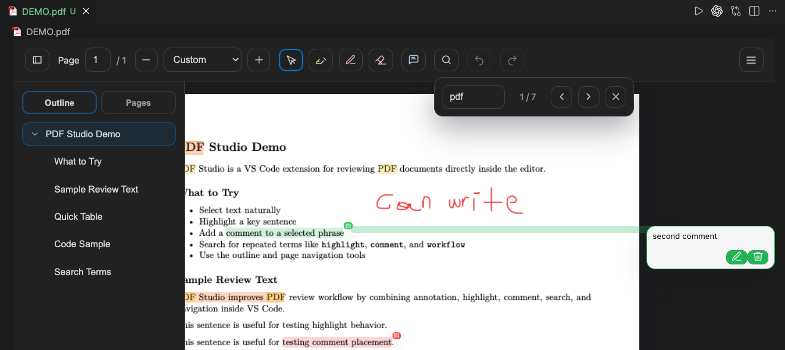

# PDF Studio

PDF Studio is a VS Code custom editor for reviewing and annotating PDF files without leaving the editor.




## Features

- Opens `*.pdf` files inside a custom PDF editor in VS Code
- Freehand annotation with color and width controls
- Text selection, inline highlight, and comment workflows
- Search, page navigation, and PDF outline/bookmark navigation
- Undo and redo support
- Auto-save directly back into the PDF file

## How It Works

- PDF pages are rendered in a local webview using vendored `pdf.js` assets
- Annotations are embedded back into the PDF for compatibility with other PDF readers
- Extension-managed annotation data is also embedded in the PDF so Studio can restore editable state on reopen

## Current Limitations

- The editor is optimized for review and markup workflows, not full PDF text editing
- Saved comments/highlights are rendered into the PDF for external-reader compatibility
- Comment/search/selection behavior depends on the embedded text layer of the source PDF; scanned image PDFs may not behave like text PDFs

## Development

```bash
npm install
npm run compile
```

If you update `pdfjs-dist`, refresh the vendored frontend assets with:

```bash
npm run sync:pdfjs
```
